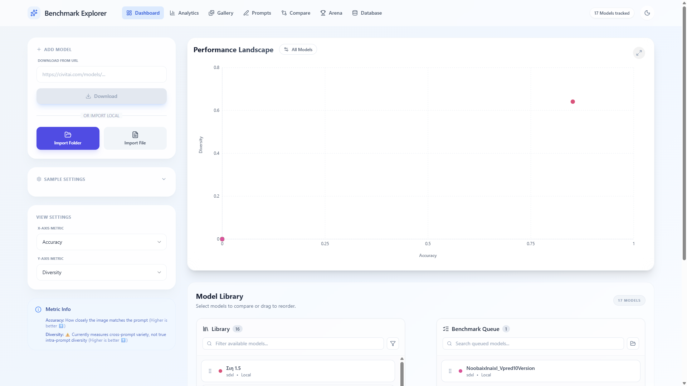
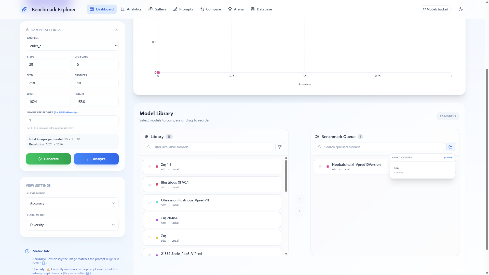
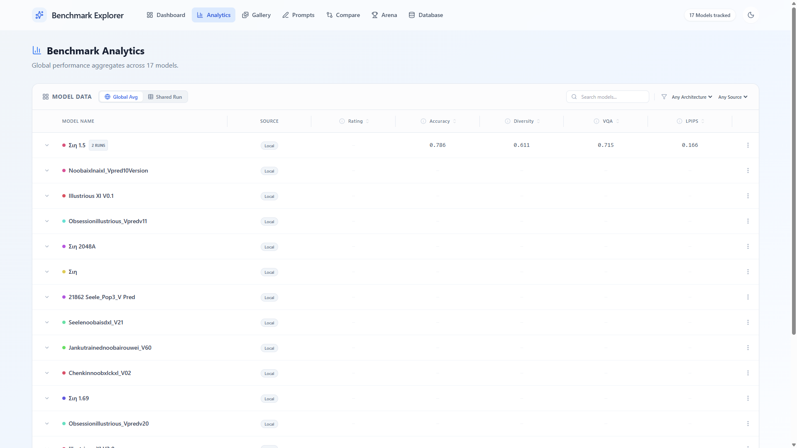
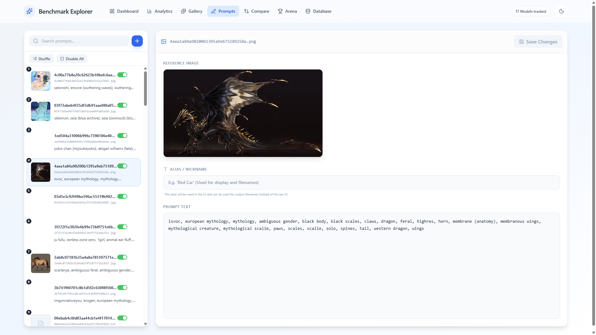
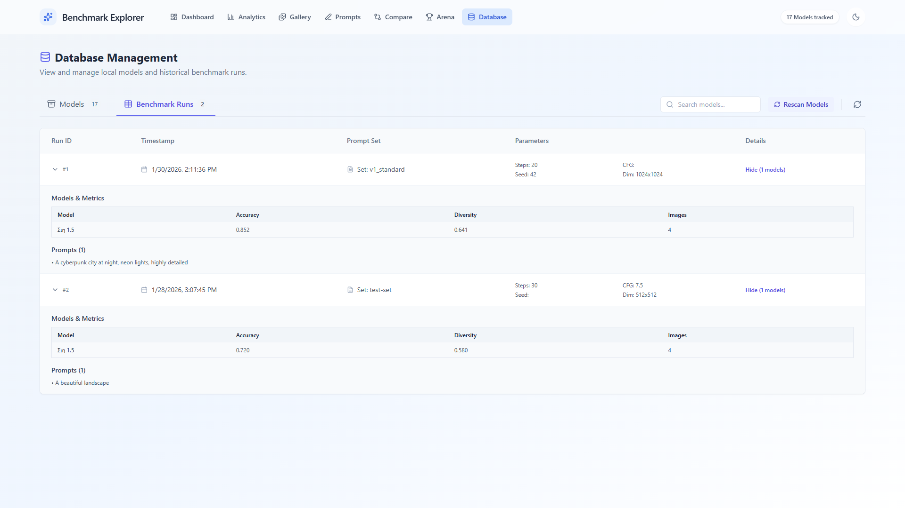

# Model Benchmark Explorer

Thingy to test and compare models. Generates images from a selection of prompts, runs automated metrics for performance, and runs them against each other for user ratings. Many more todos in progress.


_Arena for voting on outputs_

## 🚀 Screenshots

### Dashboard

| Scatter plot of metrics                                                  | Model management                                                         |
| :----------------------------------------------------------------------- | :----------------------------------------------------------------------- |
|  |  |
| _A quick bird's-eye view of model metrics._                              | _Add new models to the queue._                                           |

### Stats and arena

| Detailed Stats                                                          | Battle Mode                                                         |
| :---------------------------------------------------------------------- | :------------------------------------------------------------------ |
|  |  |
| _Check the numbers for a specific run or overall averages._             | _The Arena: pick the best image without knowing the model._         |

### Prompts & History

| Prompt Editor                                                              | Past Runs                                                              |
| :------------------------------------------------------------------------- | :--------------------------------------------------------------------- |
|  |  |
| _Basically a prompt library._                                              | _Detailed database management._                                        |

## 🛠️ Getting Started

### 1. Grab dependencies

```bash
# Frontend
npm install

# Backend
cd backend
python -m venv venv
venv\Scripts\activate
pip install -r requirements.txt
alembic upgrade head # Set up the database
```

### 2. Add some models

- Use the "Add Model" panel on the dashboard to add local models/folders or download directly from HuggingFace or CivitAI.
- Manage your prompts in the **Prompt Editor** tab.

### 3. Run ui and server

```bash
# Terminal 1: Frontend
npm run dev

# Terminal 2: Backend
cd backend
venv\Scripts\activate
uvicorn main:app --reload --port 8000
```

Open `http://localhost:3000` and start exploring!

---

## ✨ Features

- **Smart Analytics**: Switch between **Global Averages** (how the model has done so far) and **Specific Runs**.
- **Fair Comparisons**: The app catches if you're trying to compare images with different settings or if a model is missing some prompts.
- **Arena Leaderboard**: See which models generate better outputs in a blind test.
- **Deep Linking**: Click a run in the analytics tab and jump straight to it in the database for more details.
- **Side-by-Side View**: Use different views to see exactly how two models differ on the same prompt.
- **Scalable**: Virtualized lists mean you can scroll through thousands of images without lagging (hopefully).

---

## How Image Generation Works

### Directory Structure

```
backend/assets/
├── models/          # Your .safetensors models
├── prompts/         # Text files with prompts
└── outputs/         # Generated images (per model)
    └── ModelName/
        ├── p000_i00_s218.png   # Prompt 0, Image 0, Seed 218
        ├── p000_i01_s219.png   # Prompt 0, Image 1, Seed 219
        └── p001_i00_s218.png   # Prompt 1, Image 0, Seed 218
```

### Filename Convention

`p{prompt_index}_i{image_index}_s{seed}.png`

- **prompt_index**: Which prompt (0-indexed)
- **image_index**: Which image for that prompt (for diversity/LPIPS)
- **seed**: The exact seed used

### Image Metadata

Each generated image contains embedded metadata:

- `model_name`: Which model generated it
- `prompt`: The full prompt text
- `parameters`: JSON with steps, cfg, sampler, seed, dimensions
- `generation_time`: ISO timestamp
- `id`: Unique short identifier

### Seed Logic

- Each prompt uses `base_seed + image_index`
- Different prompts use the **same seed sequence** for fair comparison
- Example with `seed=218, images_per_prompt=2`:
  - Prompt 0: seeds 218, 219
  - Prompt 1: seeds 218, 219 (same!)

### Gap Handling

If an image is missing (e.g., `p001_i01` doesn't exist), the system:

1. Detects the exact missing indices
2. Regenerates only those with the correct seed
3. Won't duplicate existing images

---

## API Endpoints

### Generation & Analysis

| Endpoint                      | Method | Description                                  |
| ----------------------------- | ------ | -------------------------------------------- |
| `/api/generate`               | POST   | Generate images (no metrics)                 |
| `/api/analyze`                | POST   | Compute metrics on existing images           |
| `/api/scan`                   | POST   | Generate + Analyze                           |
| `/api/status`                 | GET    | Current generation progress                  |
| `/api/cancel`                 | POST   | Cancel running generation                    |
| `/api/check-params`           | POST   | Check if params match existing images        |
| `/api/archive/{model}`        | POST   | Archive model's images to timestamped folder |
| `/api/analyze/check-coverage` | POST   | Check prompt coverage across models          |

### Models

| Endpoint                      | Method | Description             |
| ----------------------------- | ------ | ----------------------- |
| `/api/models`                 | GET    | List analyzed models    |
| `/api/models/download`        | POST   | Download model from URL |
| `/api/models/download/status` | GET    | Download progress       |
| `/api/models/{id}`            | DELETE | Remove model            |

### Arena

| Endpoint                 | Method | Description                     |
| ------------------------ | ------ | ------------------------------- |
| `/api/arena/vote`        | POST   | Cast vote and update BT ratings |
| `/api/arena/leaderboard` | GET    | Get BT-ranked model leaderboard |

### Generation Options

```json
{
  "sampler": "euler_a",
  "steps": 28,
  "guidance_scale": 5.0,
  "seed": 218,
  "images_per_prompt": 2,
  "num_prompts": 10,
  "width": 1024,
  "height": 1536,
  "common_only": false,
  "equalize_counts": false
}
```

---

## Metrics

- **CLIP Score**: Prompt adherence (how well image matches text)
- **LPIPS Diversity**: Visual diversity between images of the same prompt
- **VQA Score**: Visual question answering based quality assessment
- **Rating**: Aesthetic rating prediction

---

## Project Structure

```
model-benchmark-explorer/
├── backend/
│   ├── main.py               # Entry point
│   ├── requirements.txt
│   ├── app/
│   │   ├── main.py           # FastAPI app setup
│   │   ├── api/              # API route handlers
│   │   │   ├── generation.py # /generate, /analyze, /scan
│   │   │   ├── models.py     # /models endpoints
│   │   │   ├── prompts.py    # /prompts endpoints
│   │   │   └── system.py     # /status, /runs
│   │   ├── services/         # Business logic
│   │   │   ├── generation.py # Image generation
│   │   │   ├── analysis.py   # Metrics computation
│   │   │   ├── model_manager.py
│   │   │   ├── prompt_manager.py
│   │   │   └── downloader.py
│   │   ├── lib/              # Core utilities
│   │   │   ├── inference.py  # SDXL pipeline wrapper
│   │   │   └── metrics.py    # CLIP & LPIPS calculation
│   │   └── core/             # Database, state, config
│   └── sd-scripts/           # Self-contained sd-scripts library
├── src/                      # React Frontend
│   ├── pages/
│   │   ├── Dashboard.tsx     # Main view with scatter plot
│   │   ├── Gallery.tsx       # Image browser
│   │   ├── Compare.tsx       # Side-by-side comparison
│   │   ├── PromptEditor.tsx  # Prompt management
│   │   └── Database.tsx      # Benchmark history
│   ├── components/           # Reusable UI components
│   ├── services/api.ts       # API client
│   └── context/              # React Context (Theme)
└── package.json
```
